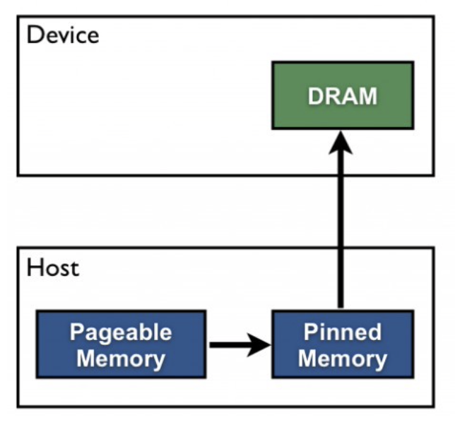
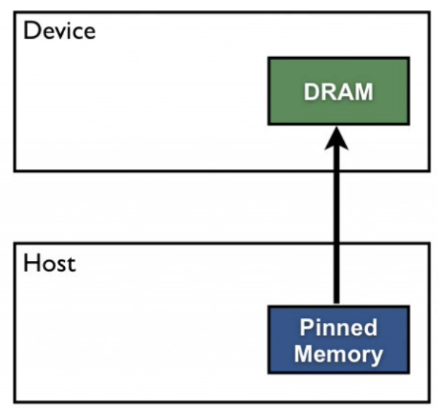
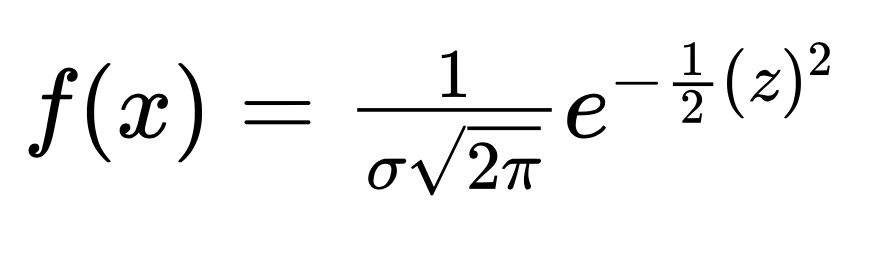
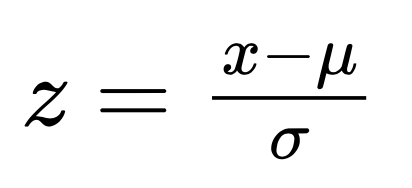
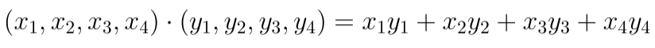
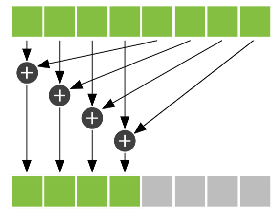

## TP4 : Programmation GPU en CUDA

### Objectifs du TP :
---------------------
* Comparez les temps de copie mémoire paginée vs. mémoire épinglée.
* Comprendre comment executer des streams de façon concurrentes.
* Comparer l'execution du programme utilisant des nombres flottant en precision simple vs. en precision double.

### Informations sur le TP :
----------------------------
* Le TP est à réaliser seul ou en binôme.
* A rendre sur ametice en spécifiant si vous avez fait le TP seul ou en binôme, en mentionnant votre prénom ainsi que votre nom (prénom et nom de chaque membre si en binôme).
* A rendre avant le 3 avril 2023, 00:00.

### Exercice 1 : Mémoire paginée vs. épinglée.
----------------------------------------------

#### Mémoire paginée

La mémoire alloué par malloc est paginable.

la fonction **cudaMemcpy** convertie implicitement la mémoire paginable en mémoire épinglé temporaire. C'est à dire que cette mémoire restera present sur la mémoire vive de l'ordinateur pendant toute l'execution du programme. 

Deux transferts de mémoire sont effetués. Par conséquent, ce type d'allocation et de transfert de mémoire est lent.

#### Mémoire épinglée

Nous avons vue en CM qu'il est possible de directement allouer de la mémoire épinglé via **cudaHostAlloc()**. En passant par cette fonction nous n'avons qu'un seul transfert de mémoire.

L'inconvénient est que, comme les données sont initialisées dans la mémoire épinglée, la disponibilité de la mémoire pour le CPU est réduite.

### Exercice 2 : Streams et execution asynchrone
------------------------------------------------

L'objectif de ce TP est d'executer une version concurrente du code en utilisant les **streams** de CUDA.

le code fournit effectue un calcul par élément sur un vecteur 1D. Chaque thread opère sur un élément du vecteur.

Le kernel calcul la moyenne de la densite de probabilité sur un interval de valeurs autour de chaque élément.

la fonction de densité de probabilité est donnée par l'équation suivante :

ou z est la loi normale donnée par l'équation :

une loi normale de moyenne (**mean**) nulle, et d'ecart type (**sigma**) unitaire est appelée **loi normale centrée réduite** ou **loi normale standard**. Dans le code, mean est fixée à 0 et sigma à 1, donc z est une loi normale standard.

Pour ce TP, il n'est pas utile de connaitre ces notions qui sont déjà implementées. Je laisse neanmoins le lien suivant pour ceux à qui ça intéresse. [Loi normale](https://fr.wikipedia.org/wiki/Loi_normale)

### Exercice 3 : Reduction via produit scalaire.
------------------------------------------------

Le but de cette exercice est de faire une reduction en implémentant un produit scalaire utilisant la mémoire global et partagée.

Ce calcul se fait en deux étapes. Tout d'abord, nous multiplions les éléments correspondants des deux vecteurs d'entrée. Cette opération est très similaire à l'addition de vecteurs, mais elle utilise la multiplication au lieu de l'addition. Cependant, au lieu de stocker ces valeurs dans un troisième vecteur de sortie, nous les additionnons toutes pour produire une seule sortie scalaire.

Exemple de produit scalaire entre deux vecteurs :

Nous pouvons effectuer la première étape exactement comme comme une addition vectorielle. Chaque thread multiplie une paire d'entrées correspondantes, puis puis la stocke dans un cache (tableau en mémoire partagée).

La façon la plus naïve d'effectuer une réduction consisterait à demander à un thread de parcourir la mémoire partagée et de calculer une somme courante. Cette opération prendrait un temps proportionnel à la longueur du tableau. Cependant, comme nous disposons de centaines de threads pour effectuer notre travail, nous pouvons effectuer cette réduction en parallèle et prendre un temps proportionnel au logarithme de la longueur du tableau. 

L'idée générale est que chaque thread additionne deux des valeurs contenues dans le **cache** et stocke le résultat dans le **cache**. Puisque chaque thread combine deux entrées en une seule, nous terminons cette étape avec moitié moins d'entrées qu'au départ. Dans l'étape suivante, nous faisons la même chose avec la moitié restante. Nous continuons ainsi pour log2(threadsPerBlock) étapes jusqu'à ce que nous ayons la somme de chaque entrée dans **cache**. Pour l'exercice, nous utilisons 256 threads par bloc, il faut donc 8 itérations de ce processus pour réduire les 256 entrées de **cache** à une seule somme.

Pour la première étape de la reduction, nous commençons avec i comme moitié du nombre de threadsPerBlock. Nous voulons que seuls les threads dont l'indice est inférieur à cette valeur travaillent. Nous ajoutons donc conditionnellement deux entrées du **cache** si l'index du thread est inférieur à i. Nous protégeons notre ajout à l'intérieur d'une condition if. Chaque thread prendra l'entrée à son index dans le **cache**, l'ajoutera à l'entrée à son index décalé de i, et stockera cette somme dans **cache** (Faites attention à la synchronisation des threads.). On divise ensuite i par 2 pour les prochaines étapes.

Une fois la reduction terminé il suffit de récupérer le premier élément du **cache** qui est le résultat du produit_scalaire.

